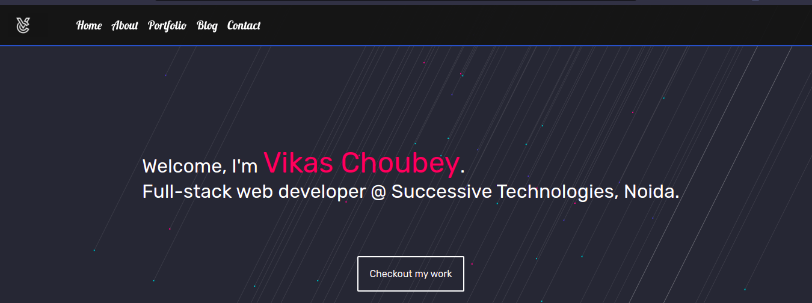

# Read Me

> Portfolio website with description of my experience so far and links to all my projects [Demo](https://vikasresume.netlify.app/)
---

### Table of Contents

- [Description](#description)
- [How To Use](#how-to-use)
- [License](#license)
- [Author Info](#author-info)

---

## Description

Portfolio website for links to my projects and experience description. This website is an online resume for potential employers and recruiters to have an initial idea of my skills, industry experiences and to demo my pet projects.

#### Technologies

- HTML
- CSS
- Javascript

[Back To The Top](#read-me)

---

## How To Use

- Just visit [https://vikasresume.netlify.app/](https://vikasresume.netlify.app/)

[Back To The Top](#read-me)

---

## License

MIT License

Copyright (c) [2021] [Vikas Choubey]

Permission is hereby granted, free of charge, to any person obtaining a copy
of this software and associated documentation files (the "Software"), to deal
in the Software without restriction, including without limitation the rights
to use, copy, modify, merge, publish, distribute, sublicense, and/or sell
copies of the Software, and to permit persons to whom the Software is
furnished to do so, subject to the following conditions:

The above copyright notice and this permission notice shall be included in all
copies or substantial portions of the Software.

THE SOFTWARE IS PROVIDED "AS IS", WITHOUT WARRANTY OF ANY KIND, EXPRESS OR
IMPLIED, INCLUDING BUT NOT LIMITED TO THE WARRANTIES OF MERCHANTABILITY,
FITNESS FOR A PARTICULAR PURPOSE AND NONINFRINGEMENT. IN NO EVENT SHALL THE
AUTHORS OR COPYRIGHT HOLDERS BE LIABLE FOR ANY CLAIM, DAMAGES OR OTHER
LIABILITY, WHETHER IN AN ACTION OF CONTRACT, TORT OR OTHERWISE, ARISING FROM,
OUT OF OR IN CONNECTION WITH THE SOFTWARE OR THE USE OR OTHER DEALINGS IN THE
SOFTWARE.

[Back To The Top](#read-me)

---

## Author Info

- LinkedIn - [@vikas-choubey](https://www.linkedin.com/in/vikas-choubey/)
- Github - [@Vikas2426](https://github.com/Vikas2426)
- Website - [Vikas Choubey](https://vikasresume.netlify.app/)

[Back To The Top](#read-me)
